# SpindleOrientationPaper.jl

This is the Julia package used in the paper: 

The spatiotemporal distribution of LIN-5/NuMA regulates spindle orientation and tissue organization in the C. elegans germ line

by Réda M Zellag; Vincent Poupart; Takefumi Negishi; Jean-Claude Labbé; Abigail Gerhold

doi: 

This package can be used to calculate the mitotic spindle orientation to a surface or to cellular main axes in 4D (3 dimensions + time). 

# Package installation 

    using Pkg
    Pkg.add(url = "https://github.com/VincentPoupart/SpindleOrientationPaper.jl.git")

# Data production and organization (to do before using the package)

This package needs:

-Surface rendering data in VRML V2.0 (.wrl) file format generated by Imaris (tested with version 9.2.1). Those files should be named according to the 4D confocal microscopy movie names. (eg: 2024-08-22_strain_name_01.wrl if the surface was produced using the movie 2024-08-22_strain_name_01.tif). Make sure there is one file per movie and at least one surface per time point during each movies when surface are generated using Imaris

-Spindle poles tracks files (.txt) generated by ImageJ FIJI (1.52v) plugin TrackMate. (See the protocole below)

-Optionally, cell shape statistics from Imaris generated by its cell segmentation tool. Those statistics should include at least the following:

-Cell_Ellipsoid_Axis_A

-Cell_Ellipsoid_Axis_B

-Cell_Ellipsoid_Axis_C

-Cell_Ellipsoid_Axis_Length_A

-Cell_Ellipsoid_Axis_Length_B

-Cell_Ellipsoid_Axis_Length_C

-Cell_Ellipticity_(prolate)

-Cell_Position

-Cell_Time

-Cell_Volume

Those statistics are exported as a folder for each movies containing a series of .csv files, one for each stats, containing all the results of the segmented cells in the movie.

All the surfaces .wrl files, the track .txt files and the cell shape stats folders should be placed in one single folder.

# Using SpindleOrientationPaper.jl

    using SpindleOrientationPaper

to fetch data from the folder into Dataframes

    Mitosis_df, Interphase_df = SpindleOrientationCellShape("Path/to/the/data/folder")

to score the mitotic steps

    Mitosis_df = ClickStepsMitosis(Mitosis_df)

To produce the figures

    GeneratingFigures(Mitosis_df, Interphase_df)

# Generate spindle poles tracks from ImageJ FIJI (1.52v) TrackMate plugin protocol

1.	Film L4 worms as described (Zellag, 2021) with a confocal SD microscope.

2.	Track the spindle poles as described (Zellag, 2021) or with the ImageJ plugin TrackMate as followed: 

2.1.	Open your registered tif file in FIJI imageJ

2.2.	Launch TrackMate from the menu Plugins  › Tracking  › TrackMate  

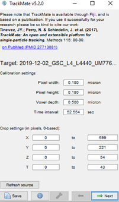

2.3.	The settings are usually correct, click “Next”

2.4.	Select log detector and click “Next”

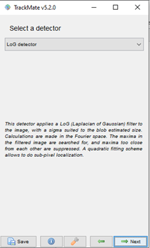 

2.5.	Select de channel corresponding to tubulin, set the estimated blob diameter to 2,5 µm and the threshold to 10. Make sure the “do subpixel localization” is checked.  

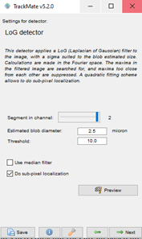

2.6.	Click Next

2.7.	Let the detection process run.

2.8.	Click Next

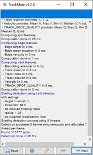

2.9.	Set the initial filter to “auto” (note here that you could do it manually depending of the quality of the movie, in a manner to catch most of the spindle poles.) Click Next.

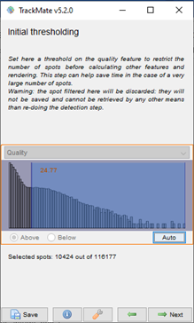

2.10.	Select “Hyperstack displayed” and click Next

2.11.	Do not set additional filter and click Next

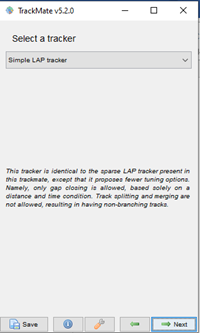

2.12.	Select “Simple LAP tracker” and 

2.13.	click Next

2.14.	Set “Linking max distance” to 5.0 micros, “Gap-closing max distance” to 5.0 micron and “Gap-closing max frame gap” to 2 and click Next

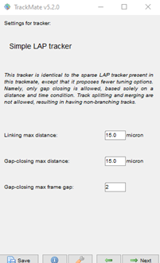
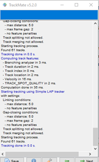

2.15.	Click Next again 

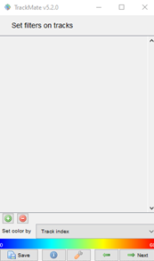

2.16.	Do not set additional filters on tracks and click Next

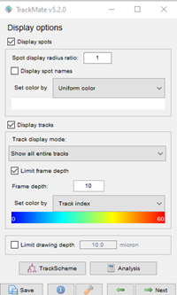

2.17.	Click on “TrackScheme” and expand the new window

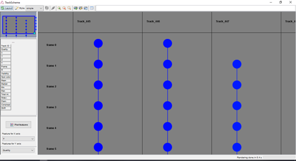

2.18.	Correct the tracks for each spindle poles and pair them 2 by 2 by naming each point of the track “cent_1a” and “cent_1b” for the first pair and “cent_2a” and “cent_2b” for the second, etc. Make sure the tracks and the pairing are correct by the help of the movie. Each time you click on a point of this TrackScheme window, the point is highlighted on the movie and vice-versa.

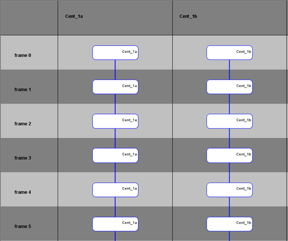

2.19.	Delete all the irrelevant tracks and make sure there is no empty spot in the track (make sure it is complete)

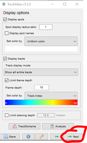

2.20.	Click  Next

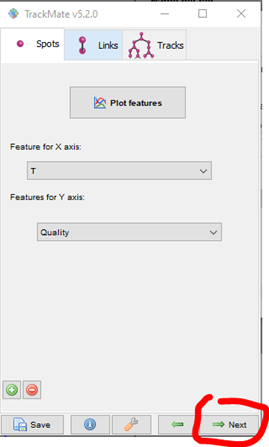

2.21.	Click  Next 

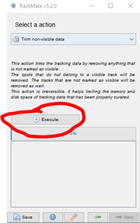

2.22.	Select « Trim non-visible data » and  click Execute

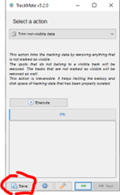

2.23.	Click  Save as movie_name.xml eg: 2020-07-16_UM776_L4_26C_24h-01.xml 

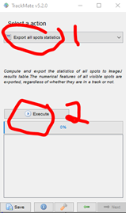

2.24.	Select « Export all spots statistics » and 

2.25.	 click Execute

2.26.	Save all spots statistics as “movie_name.txt" (eg: 2020-07-16_UM776_L4_26C_24h-01.txt)

2.27.	You can now close ImageJ.

